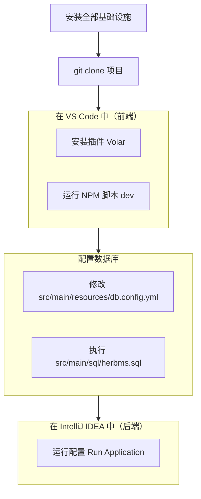
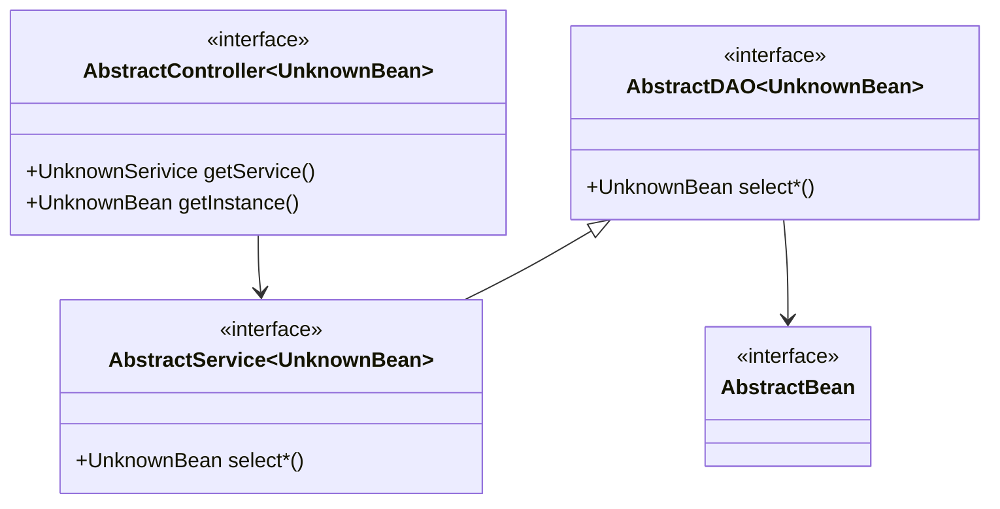

# 欢迎使用 HerbMS

Herb Management System：中药处方管理系统，基于 SSM 框架构建的 Jakarta EE 应用程序。

## 快速开始

本项目所需依赖如下：

| 名称                                                             | 类型         | 最低版本  |
|----------------------------------------------------------------|------------|-------|
| [VS Code](https://code.visualstudio.com/#alt-downloads)        | IDE        | N/A   |
| [IntelliJ IDEA](https://www.jetbrains.com/zh-cn/idea/download) | IDE        | N/A   |
| [JDK](https://www.oracle.com/cn/java/technologies/downloads/)  | 基本环境       | 17    |
| [Maven](https://maven.apache.org/download.cgi)                 | 依赖管理器      | 3.9.0 |
| [Tomcat](https://tomcat.apache.org/download-10.cgi)            | Servlet 容器 | 10    |
| [MySQL](https://dev.mysql.com/downloads/mysql/)                | 数据库        | 8.0.0 |
| [Git](https://git-scm.com/download/)                           | 版本控制器      | N/A   |
| [HerbMS-Vue](https://github.com/pen-yo/HerbMS-Vue)             | 前端         | 1.0.0 |

下图较好地概述了流程核心：

## 模块设计

HerbMS（后端）主要由四部分构成：数据容器（Bean）、数据访问代理（DAO）、业务代理（Service）和控制器代理（Controller），下图展示了各模块间的基本关系：

